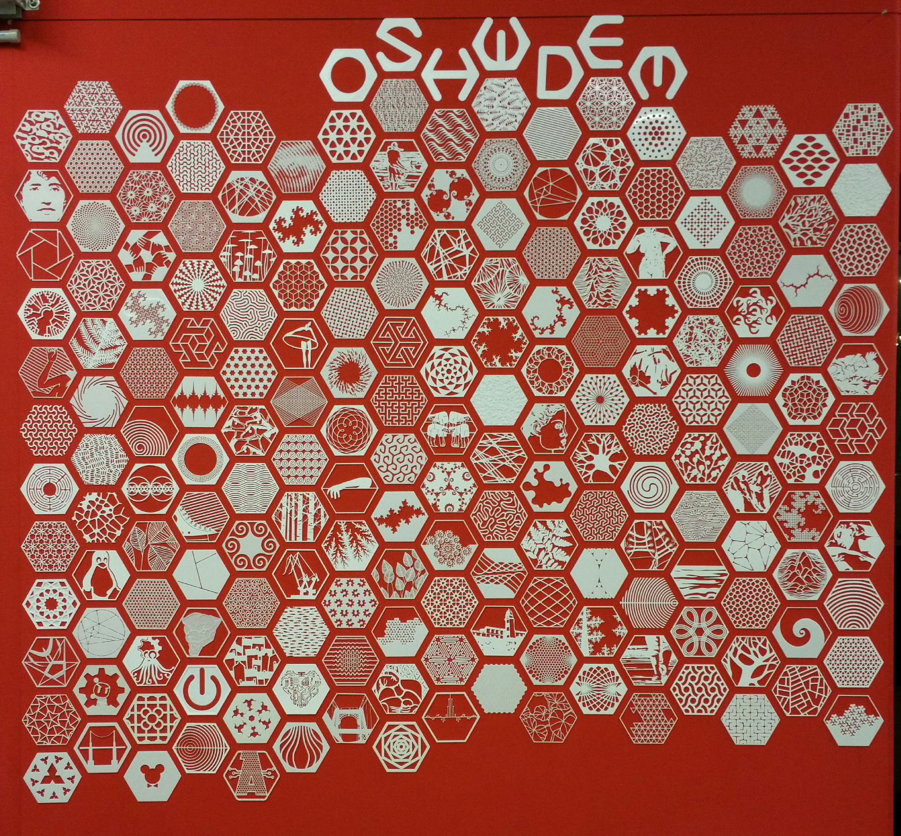
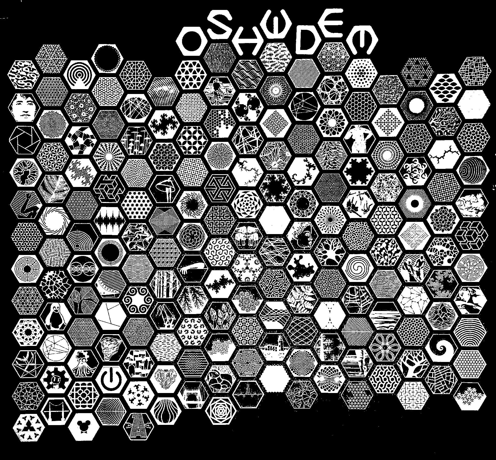
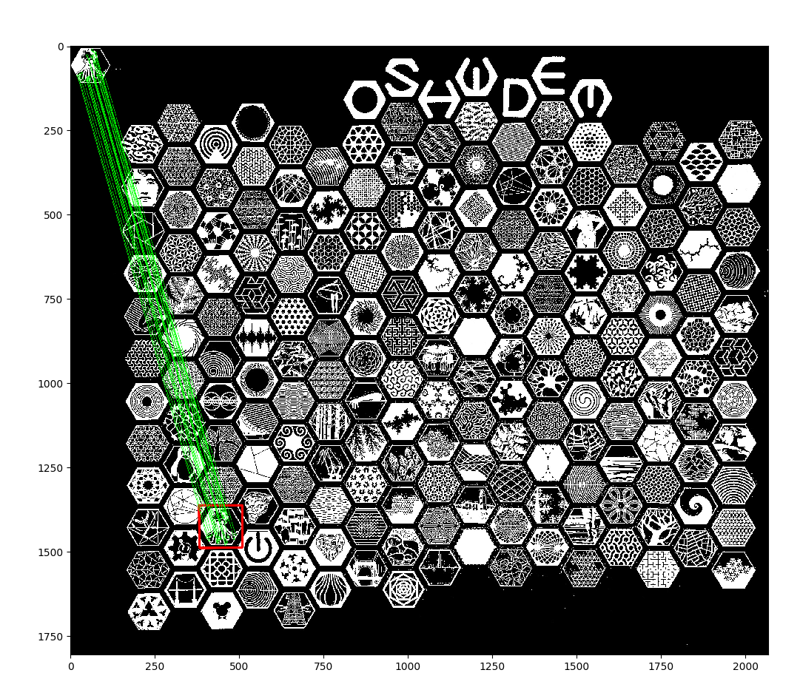
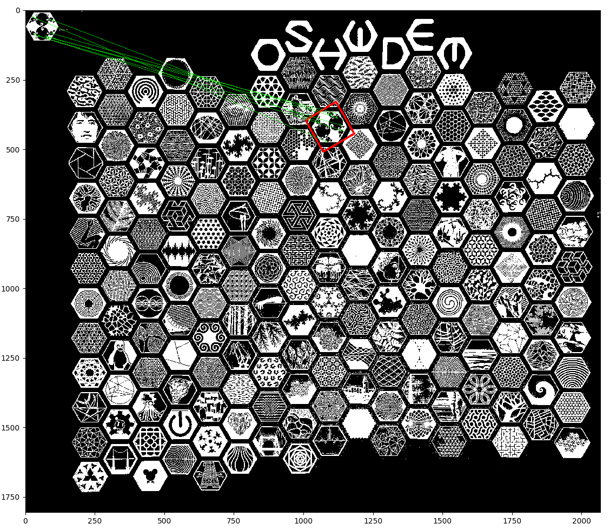

# 100Hex recogniser using OpenCV

## Introduction
In the OSHWDem 2017 event a mural of [100Hex](https://oshwdem.org/tag/100hex/) was created in a collaborative way thanks to the open source 3D printing community. More than 200 Hex were brought to the event by its creators an placed on the wall at that moment. So there was no record about the ownership of each of them.

One year later arises the need to build a 3D model of the mural in order to generate some renders and also, print some Hex that broke during that time.

The problem is that in thingiverse there are more than 600 Hex and have to be manually opened and checked to see which of them are present on the wall.

This scripts are aimed to solve this issue, using computer vision to process and find each one of the Hex automatically.



## Dependencies
This scripts use `bash`, `python3`, `ImageMagick` and `OpenScad`. Also it uses OpenCV and the following python3 dependencies.

```bash
sudo pip3 install opencv-python
sudo pip3 install opencv-contrib-python
sudo pip3 install matplotlib
```

## Usage
There are a list of scripts to automate different tasks, which are described below.

The first step was to make the reference image binary, and applying some corrections to the brightness to ease the recognition. This task was done manually using gimp as it is important that the reference image is as good as possible.



### stl2png.py
The first step was to download all the known stl files from [Thingiverse](https://www.thingiverse.com/thing:2477471). Then these models have to be rendered with the camera in orthogonal position.

To accomplish this task the stl2png.py script was created based on the work of [MLab](https://github.com/MLAB-project/stl-thumbnailer) and using OpenScad to generate the renders.


### convertAll.sh
This script reads all the stl files from one directory and convert them to images using the script above. It also applies some transformations to the image to ease the pattern matching.

 - Makes the image binary using a threshold
 - Invert the image to make the background back
 - Generates a mirrored copy to train the model with both normal and mirrored version of the HEX (as some where placed that way on the wall)
 


### detection.py
This is where magic happens. Here we use OpenCV to train a model with each of the images generated before in order to find occurrences in the reference image.

The code is structured as follows:
 - Open the reference image and extract some features using the SIFT method
 - Instantiate the FlannBasedMatcher
 - Iterate over all the images generated from the stls extracting features from them
 - Use the knnMatch to find occurrences in the reference image
 - If the match exceeds certain confidence level is marked as valid
 - The zone and the matches are marked on the original image and is shown to user



